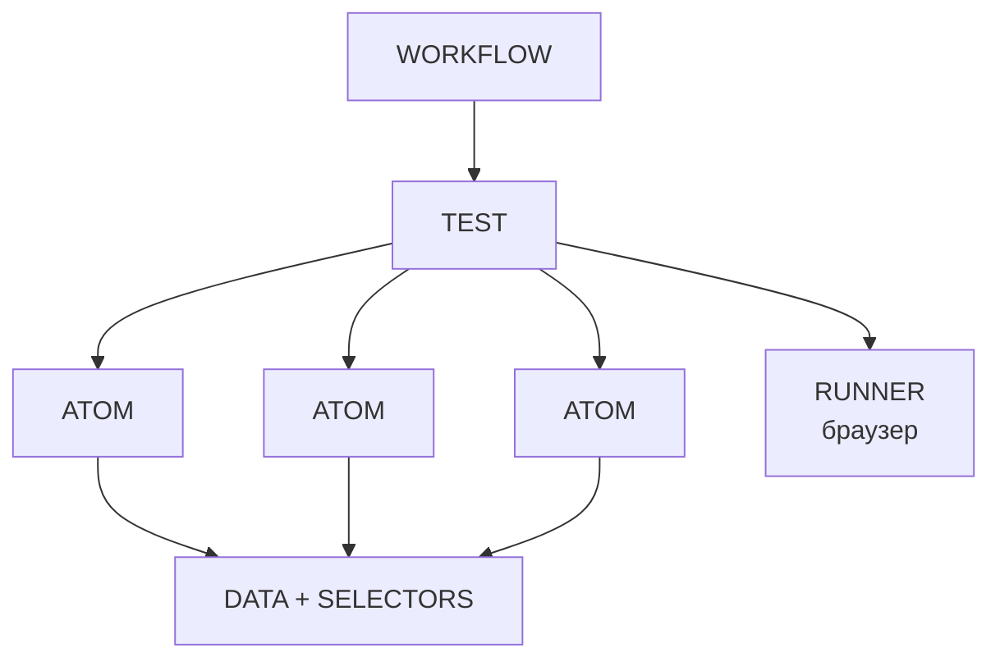
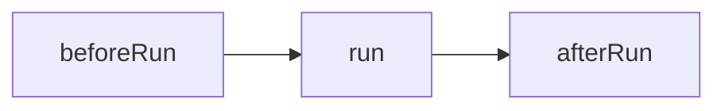

# PuppeDo: Полное руководство по созданию workflow

> **Для кого этот документ:** QA-инженеры, автоматизаторы тестирования, разработчики
> **Уровень:** от начинающего до продвинутого
> **Актуальность:** январь 2026

---

## 📚 Оглавление

### Часть I: Введение и быстрый старт
- [Что такое PuppeDo?](#что-такое-puppedo)
- [Ключевые концепции за 5 минут](#ключевые-концепции-за-5-минут)
- [Ваш первый тест](#ваш-первый-тест)
- [Форматы файлов: YAML и JSON](#форматы-файлов-yaml-и-json)

### Часть II: Основы
- [1. Агенты: строительные блоки workflow](#1-агенты-строительные-блоки-workflow)
  - [1.1 Что такое агент?](#11-что-такое-агент)
  - [1.2 Тесты vs Атомы](#12-тесты-vs-атомы)
  - [1.3 Жизненный цикл (Lifecycle)](#13-жизненный-цикл-lifecycle)
- [2. Данные и селекторы](#2-данные-и-селекторы)
  - [2.1 Что такое Data?](#21-что-такое-data)
  - [2.2 Что такое Selectors?](#22-что-такое-selectors)
  - [2.3 Inline данные vs Внешние файлы (Ext)](#23-inline-данные-vs-внешние-файлы-ext)
- [3. Runner: среда выполнения](#3-runner-среда-выполнения)
  - [3.1 Когда нужен Runner?](#31-когда-нужен-runner)
  - [3.2 Работа без Runner](#32-работа-без-runner)
  - [3.3 Конфигурация браузера](#33-конфигурация-браузера)

### Часть III: Работа с данными (ключевая тема!)
- [4. Поток данных в PuppeDo](#4-поток-данных-в-puppedo)
  - [4.1 Глобальное состояние](#41-глобальное-состояние)
  - [4.2 Каскадность данных](#42-каскадность-данных)
  - [4.3 Порядок слияния данных](#43-порядок-слияния-данных)
- [5. Вычисляемые данные (bind*)](#5-вычисляемые-данные-bind)
  - [5.1 bindData — динамические данные](#51-binddata--динамические-данные)
  - [5.2 bindSelectors — динамические селекторы](#52-bindselectors--динамические-селекторы)
  - [5.3 bindResults — работа с результатами](#53-bindresults--работа-с-результатами)
  - [5.4 Контекст выражений](#54-контекст-выражений)
- [6. Циклы и повторения](#6-циклы-и-повторения)
  - [6.1 repeat — фиксированные повторения](#61-repeat--фиксированные-повторения)
  - [6.2 while — динамические циклы](#62-while--динамические-циклы)
  - [6.3 Переменные $loop и repeat](#63-переменные-loop-и-repeat)
  - [6.4 Передача данных между итерациями](#64-передача-данных-между-итерациями)

### Часть IV: Управление выполнением
- [7. Условия](#7-условия)
  - [7.1 if — условное выполнение](#71-if--условное-выполнение)
  - [7.2 errorIf — условная ошибка](#72-errorif--условная-ошибка)
  - [7.3 errorIfResult — проверка результатов](#73-errorifresult--проверка-результатов)
- [8. Управление потоком](#8-управление-потоком)
  - [8.1 breakParentIfResult — выход из цикла](#81-breakparentifresult--выход-из-цикла)
  - [8.2 skipSublingIfResult — пропуск шагов](#82-skipsublingifresult--пропуск-шагов)
  - [8.3 disable — отключение шага](#83-disable--отключение-шага)
  - [8.4 tags — фильтрация по тегам](#84-tags--фильтрация-по-тегам)

### Часть V: Продвинутые темы
- [9. Плагины](#9-плагины)
  - [9.1 Встроенные плагины](#91-встроенные-плагины)
  - [9.2 Подключение внешних плагинов](#92-подключение-внешних-плагинов)
  - [9.3 Структура плагина](#93-структура-плагина)
- [10. Создание собственных атомов](#10-создание-собственных-атомов)
- [11. Логирование и скриншоты](#11-логирование-и-скриншоты)
- [12. inlineJS — кастомный код](#12-inlinejs--кастомный-код)
- [13. Алиасы — сокращённый синтаксис](#13-алиасы--сокращённый-синтаксис)

### Часть VI: Практика
- [14. Шаблоны и примеры](#14-шаблоны-и-примеры)
- [15. Частые ошибки](#15-частые-ошибки)
- [16. Чек-лист перед созданием workflow](#16-чек-лист-перед-созданием-workflow)

### Приложения
- [Приложение A: Полный список алиасов](#приложение-a-полный-список-алиасов)
- [Приложение B: Встроенные атомы](#приложение-b-встроенные-атомы)
- [Приложение C: Переменные окружения](#приложение-c-переменные-окружения)
- [Приложение D: Порядок выполнения агента](#приложение-d-порядок-выполнения-агента)
- [Приложение E: Слияние Data и Selectors](#приложение-e-слияние-data-и-selectors)
- [Приложение F: Поля YAML, поддерживаемые PuppeDo](#приложение-f-поля-yaml-поддерживаемые-puppedo)

---

# Часть I: Введение и быстрый старт

## Что такое PuppeDo?

**PuppeDo** — это фреймворк для автоматизации тестирования веб-приложений. Он позволяет описывать тесты в простом YAML-формате, не требуя глубоких знаний программирования.

### Главные преимущества:
- 📝 **Декларативный подход** — вы описываете *что* нужно сделать, а не *как*
- 🔄 **Переиспользование** — создавайте атомы (маленькие шаги) и комбинируйте их
- 🌐 **Два движка** — поддержка Playwright и Puppeteer
- 🧩 **Расширяемость** — плагины для любых задач

### Как читать это руководство?

1. **Новичок?** Начните с [Часть I](#часть-i-введение-и-быстрый-старт) и [Часть II](#часть-ii-основы)
2. **Есть базовые знания?** Переходите к [Часть III: Работа с данными](#часть-iii-работа-с-данными-ключевая-тема)
3. **Нужна конкретная тема?** Используйте [Оглавление](#-оглавление)

---

## Ключевые концепции за 5 минут

Прежде чем погружаться в детали, познакомьтесь с основными понятиями:

```
┌─────────────────────────────────────────────────────────────┐
│                        WORKFLOW                             │
│  ┌─────────────────────────────────────────────────────┐    │
│  │                      TEST                           │    │
│  │  ┌─────────┐  ┌─────────┐  ┌─────────┐              │    │
│  │  │  ATOM   │→ │  ATOM   │→ │  ATOM   │              │    │
│  │  └─────────┘  └─────────┘  └─────────┘              │    │
│  │       ↑            ↑            ↑                   │    │
│  │       └────────────┴────────────┘                   │    │
│  │              DATA + SELECTORS                       │    │
│  └─────────────────────────────────────────────────────┘    │
│                          ↑                                  │
│                       RUNNER                                │
│                    (браузер)                                │
└─────────────────────────────────────────────────────────────┘
```



| Термин | Что это? | Аналогия |
|--------|----------|----------|
| **Workflow** | Весь процесс тестирования | Сценарий фильма |
| **Test** | Отдельный тестовый сценарий | Сцена в фильме |
| **Atom** | Минимальное действие | Одно действие актёра |
| **Runner** | Браузер для выполнения | Съёмочная площадка |
| **Data** | Тестовые данные | Реквизит |
| **Selectors** | Адреса элементов на странице | Координаты на карте |

> 💡 **Запомните:** Test состоит из Atom-ов. Atom-ы используют Data и Selectors. Runner — это браузер, где всё происходит.

---

## Ваш первый тест

Создайте файл `myFirstTest.yaml`:

```yaml
# Имя обязательно и должно быть уникальным
name: myFirstTest

# Тип документа (можно не указывать, по умолчанию test)
type: test

# Описание для логов
description: Мой первый тест - открываем Google

# Основной блок с шагами
run:
  # Шаг 1: Переключиться на браузер
  - runnerSwitch:
      data:
        runnerName: mainRunner

  # Шаг 2: Перейти по URL
  - goTo:
      data:
        url: "https://google.com"

  # Шаг 3: Закрыть браузер
  - runnerClose:
      data:
        runnerName: mainRunner
```

**Что здесь происходит?**

1. `name: myFirstTest` — даём тесту уникальное имя
2. `run:` — это [этап жизненного цикла](#13-жизненный-цикл-lifecycle), где выполняются основные шаги
3. `runnerSwitch` — [атом](#приложение-b-встроенные-атомы), который запускает браузер
4. `goTo` — атом, который открывает страницу
5. `runnerClose` — атом, который закрывает браузер

> 📖 **Подробнее:** О том, как работают атомы, читайте в разделе [1.1 Что такое агент?](#11-что-такое-агент)

---

## Форматы файлов: YAML и JSON

PuppeDo поддерживает два формата для описания workflow:

### YAML (рекомендуется)

YAML — основной формат. Он читаемый и удобный для человека.

```yaml
name: myTest
type: test
data:
  url: "https://example.com"
  timeout: 5000
run:
  - goTo:
      data:
        url: "https://example.com"
```

**Расширения файлов:** `.yaml`, `.yml`, `.ppd`

**Несколько документов в одном файле:**
YAML поддерживает несколько документов через разделитель `---`:

```yaml
---
name: testData
type: data
data:
  baseUrl: "https://example.com"
---
name: testSelectors
type: selectors
data:
  loginButton: "#login"
```

### JSON

JSON также поддерживается, но менее удобен для ручного редактирования.

```json
{
  "name": "myTest",
  "type": "test",
  "data": {
    "url": "https://example.com"
  },
  "run": [
    {
      "goTo": {
        "data": { "url": "https://example.com" }
      }
    }
  ]
}
```

**Расширение файлов:** `.json`

> 💡 **Совет:** Используйте YAML для ручного написания тестов, JSON — для автогенерации или интеграций.

---

# Часть II: Основы

## 1. Агенты: строительные блоки workflow

### 1.1 Что такое агент?

**Агент** — это любой исполняемый блок в PuppeDo. Агенты описываются в YAML-файлах и имеют обязательное поле `name`.

```yaml
name: myAgent           # ← Обязательно! Уникальное имя
type: test              # ← Тип агента (test, atom, runner, data, selectors)
description: Описание   # ← Человекочитаемое описание
```

> 🔗 **См. также:** [Форматы файлов](#форматы-файлов-yaml-и-json), [Алиасы](#12-алиасы--сокращённый-синтаксис)

### 1.2 Тесты vs Атомы

В PuppeDo есть два основных типа агентов:

| Характеристика | Test | Atom |
|----------------|------|------|
| **Назначение** | Полный сценарий | Одно действие |
| **Размер** | Много шагов | 1-3 действия |
| **Переиспользование** | Редко | Часто |
| **Пример** | "Авторизация пользователя" | "Клик по кнопке" |

**Test** — это сценарий верхнего уровня:
```yaml
name: loginTest
type: test
run:
  - typeInput: ...
  - clickSelector: ...
  - waitForSelector: ...
```

**Atom** — это переиспользуемое действие:
```yaml
name: clickAndWait
type: atom
description: Кликнуть и подождать загрузку
run:
  - clickSelector:
      selectors: { selector: buttonSelector }
  - waitForSelector:
      selectors: { selector: loaderHidden }
```

> 💡 **Совет:** Создавайте атомы для повторяющихся действий. Это сэкономит время и упростит поддержку.

### 1.3 Жизненный цикл (Lifecycle)

**Жизненный цикл** — это последовательность этапов выполнения агента. Каждый этап — это массив шагов.

> 💡 **Важно:** Названия этапов (`beforeRun`, `run`, `afterRun`) — это **произвольные имена**, которые задаются в конфигурационном файле `puppedo.config.js` через переменную `PPD_LIFE_CYCLE_FUNCTIONS`. Они используются просто для удобства разделения жизненного цикла на логические части и могут быть изменены по вашему усмотрению.

```
┌──────────────────────────────────────────┐
│              ЖИЗНЕННЫЙ ЦИКЛ              │
│                                          │
│  ┌──────────┐   ┌─────┐   ┌───────────┐  │
│  │beforeRun │ → │ run │ → │ afterRun  │  │
│  └──────────┘   └─────┘   └───────────┘  │
└──────────────────────────────────────────┘
```



**Пример полного жизненного цикла:**

```yaml
name: fullLifecycleExample
type: test

beforeRun:
  # Подготовка: запускаем браузер и открываем страницу
  - runnerSwitch:
      data: { runnerName: mainRunner }
  - goTo:
      data: { url: "https://example.com/login" }

run:
  # Основные шаги теста
  - typeInput:
      selectors: { selector: usernameInput }
      data: { text: "testuser" }
  - typeInput:
      selectors: { selector: passwordInput }
      data: { text: "password123" }
  - clickSelector:
      selectors: { selector: submitButton }

afterRun:
  # Очистка: закрываем браузер
  - runnerClose:
      data: { runnerName: mainRunner }
```

**Важные правила:**

1. **Порядок выполнения фиксирован** — нельзя изменить последовательность этапов без изменения `PPD_LIFE_CYCLE_FUNCTIONS`
2. **Все этапы опциональны** — можно использовать только нужные
3. **Каждый этап — массив** — даже если один шаг, используйте `- `
4. **Вложенность** — внутри шага можно использовать свой lifecycle (см. [Каскадность](#42-каскадность-данных))

> 🔗 **См. также:** [Приложение D: Порядок выполнения агента](#приложение-d-порядок-выполнения-агента)

---

## 2. Данные и селекторы

### 2.1 Что такое Data?

**Data** — это **объект с ключами**, содержащий данные, которые использует тест: URL-адреса, тексты для ввода, ожидаемые значения и т.д.

```yaml
# Data - это объект с ключами
data:
  baseUrl: "https://example.com"    # Ключ: baseUrl, Значение: "https://example.com"
  username: "testuser"              # Ключ: username, Значение: "testuser"
  timeout: 5000                     # Ключ: timeout, Значение: 5000
```

> 🔗 **См. также:** [Поток данных](#4-поток-данных-в-puppedo), [bindData](#51-binddata--динамические-данные)

### 2.2 Что такое Selectors?

**Selectors** — это **объект с ключами**, содержащий CSS-селекторы или XPath для поиска элементов на странице.

```yaml
# Selectors - это объект с ключами
selectors:
  loginButton: "#login-btn"          # Ключ: loginButton, Значение: "#login-btn"
  usernameInput: "input[name='user']" # Ключ: usernameInput, Значение: "input[name='user']"
  errorMessage: ".error-msg"         # Ключ: errorMessage, Значение: ".error-msg"
```

> 💡 **Совет:** Выносите селекторы в отдельные файлы — так их легче поддерживать при изменении UI.

### 2.3 Inline данные vs Внешние файлы (Ext)

Есть **два способа** указать данные и селекторы:

#### Способ 1: Inline (прямо в шаге)

```yaml
- typeInput:
    data:                          # ← Данные прямо здесь
      text: "Hello World"
    selectors:                     # ← Селекторы прямо здесь
      selector: "#my-input"
```

**Когда использовать:** для уникальных, одноразовых значений.

#### Способ 2: Внешние файлы (Ext)

**Шаг 1:** Создайте файл данных `data/testData.yaml`:
```yaml
name: testData
type: data
data:
  baseUrl: "https://example.com"
  username: "testuser"
  password: "secret123"
```

**Шаг 2:** Создайте файл селекторов `data/selectors.yaml`:
```yaml
name: appSelectors
type: selectors
data:
  loginPage:
    usernameInput: "#username"
    passwordInput: "#password"
    submitButton: "button[type='submit']"
```

**Шаг 3:** Подключите в тесте через `dataExt` / `selectorsExt`:
```yaml
name: loginTest
dataExt:
  - testData        # ← Подключаем по имени (name)
selectorsExt:
  - appSelectors    # ← Подключаем по имени (name)

run:
  - typeInput:
      selectors: { selector: loginPage.usernameInput }  # ← Используем через точку
      data: { text: username }                          # ← Используем напрямую
```

**Когда использовать Ext:**
- Данные используются в нескольких тестах
- Селекторы могут меняться (легче править в одном месте)
- Секретные данные (пароли) — выносите в `private/` папку

> 🔗 **См. также:** [Порядок слияния данных](#43-порядок-слияния-данных), [Приватные расширения](#173-приватные-расширения)

**Сравнительная таблица:**

| Характеристика | Inline | Ext (внешний файл) |
|----------------|--------|-------------------|
| Где хранится | В самом тесте | В отдельном файле |
| Переиспользование | Нет | Да |
| Удобство изменения | Низкое | Высокое |
| Для секретов | Нет | Да (через private/) |
| Объём данных | Малый | Любой |

---

## 3. Runner: среда выполнения

### 3.1 Когда нужен Runner?

**Runner** — это конфигурация браузера. Он нужен, когда тест взаимодействует с веб-страницей.

```yaml
name: mainRunner
type: runner
browser:
  engine: playwright      # Движок: playwright или puppeteer
  browserName: chromium   # Браузер: chromium, firefox, webkit
  headless: false         # false = видимый браузер
  windowSize:
    width: 1920
    height: 1080
```

### 3.2 Работа без Runner

**Не все тесты требуют браузера!** Runner **НЕ нужен** для:

1. **CLI-утилит** — тестирование командной строки
2. **API-тестов** — запросы к серверу без UI
3. **Атомов с инкапсулированной логикой** — обработка данных, вычисления
4. **Генераторов отчётов** — работа с файлами

**Пример теста без Runner:**

```yaml
name: dataProcessingTest
type: test
description: Тест обработки данных (без браузера)

run:
  # Атом, который работает только с данными
  - calculateSum:
      data:
        values: [1, 2, 3, 4, 5]
      result:
        total: result
      errorIfResult: "total !== 15"
```

**Пример атома для CLI:**

```yaml
name: runShellCommand
type: atom
description: Выполнить команду в терминале
inlineJS: |
  const { exec } = require('child_process');
  return new Promise((resolve) => {
    exec(this.data.command, (error, stdout) => {
      resolve({ output: stdout, error: error?.message });
    });
  });
```

> 💡 **Совет:** Если ваш атом не использует `this.page`, Runner не нужен.

### 3.3 Конфигурация браузера

Полная конфигурация Runner:

```yaml
name: fullRunner
type: runner

browser:
  engine: playwright           # playwright (рекомендуется) или puppeteer
  browserName: chromium        # chromium, firefox, webkit
  headless: false              # true = без UI, false = с UI
  args:                        # Аргументы запуска браузера
    - "--start-maximized"
    - "--disable-notifications"
  windowSize:
    width: 1920
    height: 1080
  runtime:                     # Дополнительные параметры
    slowMo: 100                # Замедление действий (мс)

# Подключение данных и селекторов
dataExt:
  - testData
  - authData
selectorsExt:
  - appSelectors

# Настройки логирования
log:
  level: info
  screenshot: true
  fullpage: false
```

**Поддерживаемые движки:**

| Движок | Браузеры | Особенности |
|--------|----------|-------------|
| `playwright` | chromium, firefox, webkit | Рекомендуется, современный API |
| `puppeteer` | только chromium | Legacy, для старых проектов |

> 🔗 **См. также:** [engineSupports](#78-enginesupports-плагин)

---

# Часть III: Работа с данными (ключевая тема!)

## 4. Поток данных в PuppeDo

Понимание потока данных — **ключ к эффективной работе** с PuppeDo.

### 4.1 Глобальное состояние

В рамках одного workflow существует **глобальное состояние данных**. Это означает:

```
┌────────────────────────────────────────────────────────────┐
│                    ГЛОБАЛЬНОЕ СОСТОЯНИЕ                    │
│  ┌──────────────────────────────────────────────────────┐  │
│  │  PPD_DATA (из конфига) + Runner Data + Ext файлы     │  │
│  └──────────────────────────────────────────────────────┘  │
│                           │                                │
│                           ↓                                │
│  ┌──────────────────────────────────────────────────────┐  │
│  │                      TEST                            │  │
│  │  data: { url: "..." }  ← локальные данные            │  │
│  │                        ↓                             │  │
│  │    ┌─────────────────────────────────────────────┐   │  │
│  │    │              ATOM 1                         │   │  │
│  │    │  + свои data + результаты = новое состояние │   │  │
│  │    └─────────────────────────────────────────────┘   │  │
│  │                        ↓ результаты передаются       │  │
│  │    ┌─────────────────────────────────────────────┐   │  │
│  │    │              ATOM 2                         │   │  │
│  │    │  видит результаты ATOM 1                    │   │  │
│  │    └─────────────────────────────────────────────┘   │  │
│  └──────────────────────────────────────────────────────┘  │
└────────────────────────────────────────────────────────────┘
```

**Ключевой принцип:** Результаты предыдущего шага автоматически доступны следующему **на том же уровне вложенности**.

> ⚠️ **Важно:** Результаты из вложенных шагов (внутри `run` другого атома) **НЕ доступны** родительскому уровню по умолчанию. Чтобы передать результаты наверх, нужно использовать `bindResults` для принудительного проброса и `allowResults` для разрешения поднятия:

```yaml
run:
  - outerAtom:
      result:
        outerResult: innerResult         # Пробросить наверх
      run:
        - innerAtom:
            allowResults: [innerResult]        # ← Обязательно для поднятия
            result: { innerResult: innerDeepResult }    # Результат внутри
            run:
              - innerDeepAtom:
                  allowResults: [innerDeepResult]        # ← Обязательно для поднятия
                  result: { innerDeepResult: value }    # Результат внутри
  - nextAtom:
      # Здесь доступен outerResult, innerResult, но НЕ innerDeepResult
```

### 4.2 Каскадность данных

**Каскадность** — это когда вложенные агенты наследуют данные от родителей.

```yaml
name: cascadeExample
data:
  globalValue: "Я доступен везде"      # ← Уровень теста

run:
  - blank:
      data:
        levelOneValue: "Уровень 1"     # ← Уровень первого атома
      run:
        - blank:
            data:
              levelTwoValue: "Уровень 2"  # ← Уровень вложенного атома
            # Здесь доступны ВСЕ:
            # - globalValue
            # - levelOneValue
            # - levelTwoValue
```

**Визуализация каскада:**

```
globalValue ─────────────────────────────────────→ доступно везде
     │
     └─→ levelOneValue ──────────────────────────→ доступно в blank и ниже
              │
              └─→ levelTwoValue ─────────────────→ доступно только здесь
```

### 4.3 Порядок слияния данных

Данные собираются из разных источников в **определённом порядке**. Более поздние источники **переопределяют** предыдущие.

**Порядок для Data (от первого к последнему):**

```
1. PPD_DATA (глобальные параметры из конфига)
      ↓
2. Runner.data (данные из runner-а)
      ↓
3. dataExt (внешние файлы, подключённые через dataExt)
      ↓
4. dataParent (данные от родительского агента)
      ↓
5. resultsFromPrevSibling (результаты предыдущего шага)
      ↓
6. data (inline данные агента)
      ↓
7. bindData (вычисленные выражения)
      ↓
   ═══════════════════════════
   ИТОГОВЫЕ ДАННЫЕ АГЕНТА
```

**Пример приоритета:**

```yaml
# В puppedo.config.js: PPD_DATA = { url: "config.com" }
# В runner: data: { url: "runner.com" }
# В тесте:
name: priorityExample
data:
  url: "test.com"           # ← Этот URL победит!

run:
  - goTo:
      bindData:
        url: "'final.com'"   # ← Но этот победит ещё сильнее!
```

**Результат:** `url = "final.com"`

> 🔗 **См. также:** [bindData](#51-binddata--динамические-данные)

---

## 5. Вычисляемые данные (bind*)

Семейство `bind*` — это **мощный инструмент** для динамических данных.

### 5.1 bindData — динамические данные

**bindData** позволяет вычислять значения через JavaScript-выражения.

**Синтаксис:**
```yaml
bindData:
  ключ: "JavaScript выражение"
```

**Примеры:**

```yaml
# Конкатенация строк
bindData:
  fullUrl: "baseUrl + '/login'"          # → "https://example.com/login"

# Работа с числами
bindData:
  nextPage: "currentPage + 1"            # → 2

# Условные значения
bindData:
  greeting: "isAdmin ? 'Admin' : 'User'" # → "User" или "Admin"

# Работа с массивами
bindData:
  firstItem: "items[0]"                   # → первый элемент
  itemCount: "items.length"               # → количество элементов

# Форматирование дат
bindData:
  today: "new Date().toISOString()"       # → "2026-01-17T..."
```

**Контекст выражения:**
В выражении доступны все текущие data + selectors + results:

```yaml
name: contextExample
data:
  baseUrl: "https://example.com"
  userId: 42

run:
  - blank:
      bindData:
        # Здесь доступны baseUrl и userId
        profileUrl: "baseUrl + '/user/' + userId"  # → "https://example.com/user/42"
```

**Обработка ошибок:**
Если выражение не удаётся вычислить, значение остаётся **исходной строкой** (без ошибки).

```yaml
bindData:
  safe: "undefinedVariable + 1"  # → "undefinedVariable + 1" (строка, не ошибка)
```

> 🔗 **См. также:** [Контекст выражений](#54-контекст-выражений), [Алиасы](#12-алиасы--сокращённый-синтаксис) (`bD` = `bindData`)

### 5.2 bindSelectors — динамические селекторы

**bindSelectors** работает аналогично bindData, но для селекторов.

**Когда использовать:**
- Селектор зависит от данных (номер элемента, ID)
- Селектор формируется динамически

**Примеры:**

```yaml
# Селектор с индексом
data:
  rowIndex: 3
bindSelectors:
  row: "'table tr:nth-child(' + rowIndex + ')'"  # → "table tr:nth-child(3)"

# Селектор с ID из данных
data:
  productId: "abc123"
bindSelectors:
  product: "'#product-' + productId"              # → "#product-abc123"

# Выбор селектора по условию
data:
  isMobile: true
bindSelectors:
  menu: "isMobile ? '.mobile-menu' : '.desktop-menu'"
```

> 🔗 **См. также:** [Алиасы](#12-алиасы--сокращённый-синтаксис) (`bS` = `bindSelectors`)

### 5.3 bindResults — работа с результатами

**bindResults** (или просто `r`) — для **сохранения и преобразования результатов**.

**Два режима работы:**

#### Режим 1: Сохранение результата атома

```yaml
- getText:
    selectors: { selector: header }
    result:                           # ← Сохраняем результат
      headerText: text                # headerText = значение из text (результата атома)
```

#### Режим 2: Вычисление нового значения

```yaml
- blank:
    data:
      price: 100
      quantity: 5
    result:                           # ← Вычисляем
      total: "price * quantity"  # total = 500
```

**Комбинированный пример:**

```yaml
run:
  # Шаг 1: Получаем текст
  - getText:
      selectors: { selector: priceElement }
      result:
        rawPrice: text           # rawPrice = "$19.99"

  # Шаг 2: Преобразуем результат
  - blank:
      result:
        numericPrice: "parseFloat(rawPrice.replace('$', ''))"  # → 19.99
        withTax: "numericPrice * 1.2"                          # → 23.99
```

**Ограничение результатов через allowResults:**

```yaml
name: restrictedAtom
type: atom
allowResults:                    # ← Разрешённые ключи
  - status
  - message

run:
  - someAction:
      result:
        status: result           # ✓ Разрешено
        message: text            # ✓ Разрешено
        secret: password         # ✗ Будет отфильтровано!
```

> ⚠️ **Важно:** `allowResults` не просто фильтрует нежелательные результаты, но и является **обязательным условием** для того, чтобы результаты могли быть подняты на уровень родительского агента. Без указания `allowResults` результаты остаются локальными для текущего агента и не доступны снаружи.

> 🔗 **См. также:** [Алиасы](#12-алиасы--сокращённый-синтаксис) (`r`, `v`, `var`, `let` = `bindResults`)

### 5.4 Контекст выражений

**Что доступно в контексте выражений:**

| Источник | Описание | Пример |
|----------|----------|--------|
| `data` | Все текущие данные | `baseUrl`, `userId` |
| `selectors` | Все текущие селекторы | `loginButton` |
| `results` | Результаты предыдущих шагов | `headerText`, `total` |
| `repeat` | Счётчик повторений | `repeat` (убывает от N до 1) |
| `$loop` | Номер итерации | `$loop` (возрастает от 1) |
| `stepId` | ID текущего шага | `stepId` |

**Где используются выражения:**

| Поле | Ошибка при неудаче | Описание |
|------|-------------------|----------|
| `bindData` | Нет (остаётся строка) | Вычисление данных |
| `bindSelectors` | Нет | Вычисление селекторов |
| `bindResults` | Нет | Вычисление результатов |
| `if` | **Да** | Условие выполнения |
| `errorIf` | **Да** | Условие ошибки |
| `errorIfResult` | **Да** | Проверка результатов |
| `while` | **Да** | Условие цикла |
| `repeat` | **Да** | Число повторений |
| `bindDescription` | Нет | Динамическое описание |

---

## 6. Циклы и повторения

### 6.1 repeat — фиксированные повторения

**repeat** выполняет агент заданное количество раз.

```yaml
# Простой repeat
- blank:
    repeat: 3                    # Выполнится 3 раза
    run:
      - clickSelector:
          selectors: { selector: nextButton }
```

**repeat как выражение:**

```yaml
data:
  pageCount: 5

run:
  - blank:
      repeat: "pageCount"        # Выполнится 5 раз (значение из данных)
      run:
        - processPage:
```

### 6.2 while — динамические циклы

**while** продолжает цикл, пока условие истинно.

```yaml
data:
  maxAttempts: 10

run:
  - blank:
      repeat: 1                               # Начинаем с 1
      while: "!found && $loop < maxAttempts"  # Продолжаем пока не найдём
      run:
        - searchItem:
            result:
              found: result
```

**Как это работает:**
1. `repeat: 1` — начальное значение
2. После каждой итерации проверяется `while`
3. Если `while` = true, `repeat` увеличивается на 1
4. Цикл продолжается

### 6.3 Переменные $loop и repeat

В контексте цикла доступны две переменные:

| Переменная | Направление | Пример для repeat: 3 |
|------------|-------------|---------------------|
| `repeat` | ↓ убывает | 3 → 2 → 1 |
| `$loop` | ↑ возрастает | 1 → 2 → 3 |

```yaml
- blank:
    repeat: 3
    run:
      - blank:
          bindDescription: "'Итерация ' + $loop + ' из 3, repeat=' + repeat"
          # Выведет:
          # "Итерация 1 из 3, repeat=3"
          # "Итерация 2 из 3, repeat=2"
          # "Итерация 3 из 3, repeat=1"
```

**Использование $loop для индексации:**

```yaml
data:
  items: ["apple", "banana", "cherry"]

run:
  - blank:
      repeat: "items.length"
      run:
        - processItem:
            bindData:
              currentItem: "items[$loop - 1]"  # $loop начинается с 1!
            # currentItem будет: "apple", "banana", "cherry"
```

### 6.4 Передача данных между итерациями

Результаты предыдущей итерации **автоматически доступны** в следующей.

```yaml
run:
  - blank:
      data:
        total: 0                 # Начальное значение
      repeat: 5
      run:
        - blank:
            result:
              total: "total + $loop"  # Накапливаем сумму
      # После цикла: total = 1 + 2 + 3 + 4 + 5 = 15
```

**Визуализация:**

```
Итерация 1: total = 0 + 1 = 1  → передаётся в итерацию 2
Итерация 2: total = 1 + 2 = 3  → передаётся в итерацию 3
Итерация 3: total = 3 + 3 = 6  → передаётся в итерацию 4
Итерация 4: total = 6 + 4 = 10 → передаётся в итерацию 5
Итерация 5: total = 10 + 5 = 15 → финальный результат
```

> 🔗 **См. также:** [breakParentIfResult](#81-breakparentifresult--выход-из-цикла)

---

# Часть IV: Управление выполнением

## 7. Условия

### 7.1 if — условное выполнение

**if** выполняет шаг только если условие истинно. При ложном условии шаг **пропускается без ошибки**.

```yaml
# Выполнить только если есть элементы
- processItems:
    if: "items && items.length > 0"

# Выполнить только для админа
- adminPanel:
    if: "userRole === 'admin'"

# Проверка нескольких условий
- specialCase:
    if: "isEnabled && count > 10 && status === 'active'"
```

### 7.2 errorIf — условная ошибка

**errorIf** вызывает ошибку если условие истинно.

```yaml
# Ошибка если статус неверный
- checkStatus:
    errorIf: "status !== 'ok'"

# Ошибка если элемент не найден
- validateElement:
    errorIf: "!elementExists"

# С кастомным сообщением (плагин descriptionError)
- checkValue:
    descriptionError: "'Ожидалось ' + expected + ', получено ' + actual"
    errorIf: "actual !== expected"
```

### 7.3 errorIfResult — проверка результатов

**errorIfResult** проверяет результаты **после** выполнения шага.

```yaml
# Проверить, что текст не пустой
- getText:
    seletors: { selector: title }
    result: { titleText: text }
    errorIfResult: "!titleText || titleText.trim() === ''"

# Проверить числовое значение
- getCount:
    seletors: { selector: counter }
    result: { count: value }
    errorIfResult: "parseInt(count) < 0"
```

**Разница между errorIf и errorIfResult:**

| Поле | Когда проверяется | Доступ к результатам |
|------|-------------------|---------------------|
| `errorIf` | **ДО** выполнения | Нет |
| `errorIfResult` | **ПОСЛЕ** выполнения | Да |

---

## 8. Управление потоком

### 8.1 breakParentIfResult — выход из цикла

**breakParentIfResult** прерывает родительский цикл при истинном условии.

```yaml
run:
  - blank:
      repeat: 100                        # Максимум 100 итераций
      run:
        - searchForItem:
            result: { found: result }
            breakParentIfResult: "found === true"  # Выйти когда нашли
        - processItem:                    # Этот шаг не выполнится после break
```

**Важно:** breakParentIfResult:
- Прерывает **родительский** уровень (не текущий)
- Возвращает результаты наверх
- Работает как `break` в обычных циклах

### 8.2 skipSublingIfResult — пропуск шагов

**skipSublingIfResult** пропускает **последующие** шаги того же уровня.

```yaml
run:
  - checkCondition:
      result: { shouldSkip: flag }
      skipSublingIfResult: "shouldSkip"

  - step2:                    # ← Пропустится если shouldSkip = true
      description: Будет пропущен

  - step3:                    # ← Тоже пропустится
      description: Тоже пропущен
```

**В цикле:**

```yaml
- blank:
    repeat: 5
    run:
      - checkItem:
          skipSublingIfResult: "$loop === 3"  # На 3-й итерации
      - processItem:          # ← Пропустится только при $loop === 3
      - logItem:              # ← Тоже пропустится
```

### 8.3 disable — отключение шага

**disable: true** полностью отключает шаг.

```yaml
# Временно отключить шаг
- brokenFeature:
    disable: true             # Шаг пропускается
    run:
      - something:
```

> 💡 **Совет:** Используйте `disable` для временного отключения шагов во время отладки.

### 8.4 tags — фильтрация по тегам

**tags** позволяет запускать только определённые тесты.

```yaml
name: smokeTest
tags:
  - smoke
  - critical
run:
  - ...

---
name: fullRegressionTest
tags:
  - regression
  - full
run:
  - ...
```

**Запуск по тегам:**

```bash
# Запустить только smoke тесты
ppd --tags smoke

# Запустить smoke ИЛИ critical
ppd --tags smoke,critical
```

---

# Часть V: Продвинутые темы

## 9. Плагины

### 9.1 Встроенные плагины

PuppeDo включает набор встроенных плагинов:

| Плагин | Назначение | Пример использования |
|--------|------------|---------------------|
| `continueOnError` | Продолжить при ошибке | `continueOnError: true` |
| `debug` | Отладка (пауза) | `debug: true` |
| `descriptionError` | Кастомное сообщение ошибки | `descriptionError: "'Error: ' + msg"` |
| `engineSupports` | Ограничение по движку | `engineSupports: [playwright]` |
| `frame` | Работа с iframe | `frame: "iframe#content"` |
| `logOptions` | Настройки логирования | См. [раздел 11](#11-логирование-и-скриншоты) |
| `options` | Наследуемые опции | `options: { timeout: 5000 }` |
| `skipSublingIfResult` | Пропуск шагов | См. [раздел 8.2](#82-skipsublingifresult--пропуск-шагов) |

### 9.2 Подключение внешних плагинов

Плагины подключаются через `puppedo.config.js`:

```javascript
// puppedo.config.js
module.exports = {
  // Стандартные папки с плагинами
  PPD_ROOT_ADDITIONAL: [
    'src/Plugins',           // Встроенные плагины
    'my-plugins',            // Ваши кастомные плагины
    'node_modules/puppedo-community-plugins'  // Внешние пакеты
  ],

  // Игнорировать определённые папки
  PPD_ROOT_IGNORE: [
    'node_modules',
    'dist'
  ]
};
```

### 9.3 Структура плагина

> ⚠️ **Важно:** Плагины и атомы — это **разные концепции**!
>
> | Атомы | Плагины |
> |-------|--------|
> | Действия для workflow | Расширения ядра PuppeDo |
> | Вызываются по имени (`- myAtom:`) | Работают автоматически для ВСЕХ агентов |
> | Описываются в YAML | Пишутся на TypeScript |
> | Создаёте вы как пользователь | Обычно создаются разработчиками фреймворка |

**Плагины** — это функции, которые расширяют ядро PuppeDo. Они добавляют новые поля к агентам или изменяют поведение на определённых этапах выполнения.

**Примеры встроенных плагинов:**
- `if` — условное выполнение агента
- `repeat` — повторение агента
- `engineSupports` — проверка поддержки браузерным движком
- `continueOnError` — продолжение при ошибке

**Структура плагина:**
```
src/Plugins/
  └── myPlugin/
      └── myPlugin.ts    # Логика плагина
```

**myPlugin.ts:**
```typescript
import type { PluginFunction } from 'puppedo';

const myPlugin: PluginFunction = {
  name: 'myPlugin',
  hook: 'beforeExecute',  // Когда вызывать: beforeExecute, afterExecute, etc.
  fn: async (agent, context) => {
    // Доступ к agent.myPluginField
    if (agent.myPluginField) {
      // Логика плагина
    }
    return agent;
  }
};

export default myPlugin;
```

> 💡 **Когда создавать плагин?** Когда вам нужна функциональность, которая должна работать для ВСЕХ агентов автоматически, а не вызываться вручную.

---


## 10. Создание собственных атомов

Атомы — это переиспользуемые действия. Их можно создавать тремя способами:

### 10.1 Способ 1: Только YAML (композиция существующих атомов)

```yaml
# my-atoms/loginUser.yaml
name: loginUser
type: atom
description: Авторизация пользователя

needData:
  - username
  - password
needSelectors:
  - usernameInput
  - passwordInput
  - submitButton

run:
  - typeInput:
      selectors: { selector: usernameInput }
      data: { text: username }
  - typeInput:
      selectors: { selector: passwordInput }
      data: { text: password }
  - clickSelector:
      selectors: { selector: submitButton }
```

### 10.2 Способ 2: YAML + JavaScript (кастомная логика)

Для сложной логики можно подключить JS/TS файл:

**Структура:**
```
my-atoms/
  └── myCustomAtom/
      ├── myCustomAtom.yaml    # Определение атома
      └── myCustomAtom.ts      # Логика на JS/TS
```

**myCustomAtom.yaml:**
```yaml
name: myCustomAtom
type: atom
description: Атом с кастомной логикой

needData:
  - inputValue
allowResults:
  - processedValue
  - success

# Логика будет загружена из myCustomAtom.ts
```

**myCustomAtom.ts:**
```typescript
import type { AtomRun } from 'puppedo';

const atomRun: AtomRun = async function() {
  // this.data - данные
  // this.selectors - селекторы
  // this.page - страница браузера
  // this.options - опции

  const result = this.data.inputValue * 2;

  return {
    processedValue: result,
    success: true
  };
};

export default atomRun;
```

### 10.3 Способ 3: inlineJS (быстрая кастомизация)

Для простых случаев можно использовать `inlineJS` прямо в YAML:

```yaml
name: quickCalculation
type: atom
description: Быстрое вычисление

needData:
  - a
  - b

inlineJS: |
  const sum = this.data.a + this.data.b;
  const product = this.data.a * this.data.b;
  return { sum, product };
```


## 11. Логирование и скриншоты

**logOptions** управляет логированием каждого шага:

```yaml
- importantStep:
    logOptions:
      logThis: true              # Логировать этот шаг
      logChildren: true          # Логировать дочерние
      screenshot: true           # Делать скриншот элемента
      fullpage: false            # Скриншот всей страницы
      screenshotName: "step1"    # Имя файла скриншота
      textColor: green           # Цвет текста в логе
      backgroundColor: black     # Фон в логе
```

**Для скриншотов элемента нужен селектор:**

```yaml
- screenshotStep:
    needSelectors:
      - targetElement
    bindSelectors:
      targetElement: "#my-element"
    logOptions:
      screenshot: true
```

> 🔗 **См. также:** [needSelectors](#needdata--needselectors)

---

## 12. inlineJS — кастомный код

**inlineJS** позволяет выполнять произвольный JavaScript.

```yaml
- customAction:
    inlineJS: |
      // Доступные объекты:
      // this.data - текущие данные
      // this.selectors - текущие селекторы
      // this.page - объект страницы (Playwright/Puppeteer)
      // this.options - опции

      const element = await this.page.$(this.selectors.myElement);
      const text = await element.textContent();

      // Вернуть результат
      return { extractedText: text };
```

**Валидация входных данных:**

```yaml
- safeInlineJS:
    needData:
      - requiredParam
    needSelectors:
      - requiredSelector
    inlineJS: |
      // Теперь гарантированно есть this.data.requiredParam
      // и this.selectors.requiredSelector
```

---

## 13. Алиасы — сокращённый синтаксис

**Алиасы** — это короткие имена для часто используемых полей.

**Полная форма:**
```yaml
- typeInput:
    data:
      text: "Hello"
    selectors:
      selector: "#input"
    bindResults:
      typed: result
```

**С алиасами:**
```yaml
- typeInput:
    d: { text: "Hello" }      # d = data
    s: { selector: "#input" } # s = selectors
    r: { typed: result }      # r = bindResults
```

**Полный список алиасов:**

| Полное имя | Алиасы |
|------------|--------|
| `data` | `d`, `📋` |
| `bindData` | `bD`, `bd`, `dF`, `df` |
| `selectors` | `s`, `selector`, `💠` |
| `bindSelectors` | `bS`, `bs`, `sF`, `sf` |
| `bindResults` | `r`, `v`, `var`, `let`, `set`, `results` |
| `options` | `o`, `opt`, `⚙️` |

> 🔗 **См. также:** [Приложение A: Полный список алиасов](#приложение-a-полный-список-алиасов)

---

# Часть VI: Практика

## 14. Шаблоны и примеры

### Минимальный тест

```yaml
name: minimalTest
run:
  - goTo:
      data: { url: "https://example.com" }
```

### Тест с полным lifecycle

```yaml
name: completeTest
type: test
description: Тест с подготовкой и очисткой

beforeRun:
  - runnerSwitch:
      data: { runnerName: mainRunner }
  - goTo:
      bindData: { url: "baseUrl + '/login'" }

run:
  - typeInput:
      selectors: { selector: usernameInput }
      data: { text: username }
  - typeInput:
      selectors: { selector: passwordInput }
      data: { text: password }
  - clickSelector:
      selectors: { selector: submitButton }
  - waitForSelector:
      selectors: { selector: dashboard }

afterRun:
  - runnerClose:
      data: { runnerName: mainRunner }
```

### Цикл с условным выходом

```yaml
name: searchLoop
run:
  - blank:
      repeat: 10
      run:
        - findItem:
            result: { found: result }
            breakParentIfResult: "found"
        - clickSelector:
            selectors: { selector: nextPage }
```

---

## 15. Частые ошибки

| Ошибка | Причина | Решение |
|--------|---------|---------|
| Дубли имён | Два агента с одинаковым name | Используйте уникальные имена |
| needData failed | Отсутствует обязательный параметр | Добавьте данные или используйте `?` |
| Data/Selectors conflict | Одинаковый ключ с разными значениями | Используйте разные имена |
| Expression error | Синтаксическая ошибка в JS | Проверьте кавычки и синтаксис |
| Screenshot failed | Нет needSelectors | Добавьте needSelectors для скриншота |

---

## 16. Чек-лист перед созданием workflow

**Перед началом:**
- [ ] Определены все runners?
- [ ] Созданы файлы data и selectors?
- [ ] Секретные данные в `private/`?

**При создании:**
- [ ] Уникальные имена агентов?
- [ ] Описания для каждого шага?
- [ ] needData/needSelectors указаны?
- [ ] JS-выражения синтаксически корректны?

**После создания:**
- [ ] Тест запускается без ошибок?
- [ ] Логи информативны?
- [ ] Скриншоты создаются?

---

# Приложения

## Приложение A: Полный список алиасов

> 💡 **Настройка:** Алиасы настраиваются в `puppedo.config.js` через переменную `PPD_ALIASES`. Вы можете добавить свои алиасы или изменить существующие.

```javascript
// puppedo.config.js
module.exports = {
  PPD_ALIASES: {
    data: ['d', 'myCustomDataAlias'],
    selectors: ['s', 'sel'],
    // ... другие алиасы
  }
};
```

**Алиасы по умолчанию:**

| Группа | Полное имя | Алиасы |
|--------|-----------|--------|
| Данные | `data` | `d`, `📋` |
| Вычисляемые данные | `bindData` | `bD`, `bd`, `📌📋`, `dataBind`, `db`, `dB`, `dataFunction`, `dF`, `df`, `🔑📋`, `functionData`, `fd`, `fD` |
| Селекторы | `selectors` | `selector`, `s`, `💠` |
| Вычисляемые селекторы | `bindSelectors` | `bindSelector`, `bS`, `bs`, `📌💠`, `selectorBind`, `selectorsBind`, `sb`, `sB`, `selectorsFunction`, `selectorFunction`, `sF`, `sf`, `🔑💠`, `functionSelector`, `functionSelectors`, `fs`, `fS` |
| Результаты | `bindResults` | `bindResult`, `bR`, `br`, `result`, `results`, `r`, `↩️`, `R`, `rb`, `rB`, `resultBind`, `resultsBind`, `rF`, `rf`, `🔑↩️`, `functionResult`, `fr`, `fR`, `resultFunction`, `values`, `value`, `v`, `var`, `vars`, `const`, `c`, `let`, `set` |
| Опции | `options` | `option`, `opt`, `o`, `⚙️` |

> 🔗 **См. также:** [Приложение E: Слияние Data и Selectors](#приложение-e-слияние-data-и-selectors)

---

## Приложение B: Встроенные атомы

> ⚠️ **Важно:** В ядре PuppeDo встроенных атомов нет. Атомы поставляются отдельным пакетом [@puppedo/atoms](https://github.com/starikan/PuppeDoAtoms).

### Подключение атомов

**Способ 1: Через npm и конфигурацию (рекомендуется)**

```bash
npm install @puppedo/atoms
```

```javascript
// puppedo.config.js
module.exports = {
  PPD_ROOT_ADDITIONAL: [
    'node_modules/@puppedo/atoms/src',  // Подключаем папку с атомами
    // ... другие папки с вашими атомами
  ],
};
```

**Способ 2: Программное подключение через require**

```javascript
// Автоматически добавляется в PPD_ROOT_ADDITIONAL
require('@puppedo/atoms');
```

**Способ 3: Через аргументы командной строки**

```bash
ppd PPD_ROOT_ADDITIONAL=node_modules/@puppedo/atoms/src
```

---

### Категории атомов

Атомы из пакета `@puppedo/atoms` разделены на категории:

#### 🔲 Базовые (blank)

| Атом | Описание | needData | needSelectors | allowResults |
|------|----------|----------|---------------|--------------|
| `blank` | Пустой контейнер для lifecycle/inlineJS | — | — | — |
| `case` | Пустой контейнер для lifecycle/inlineJS | — | — | — |
| `if` | Пустой контейнер для lifecycle/inlineJS | — | — | — |
| `initData` | Пустой контейнер для lifecycle/inlineJS | — | — | — |
| `loop` | Пустой контейнер для lifecycle/inlineJS | — | — | — |
| `test` | Пустой контейнер для lifecycle/inlineJS | — | — | — |
| `todo` | Пустой контейнер для lifecycle/inlineJS | — | — | — |

#### 🌐 Основные (main)

| Атом | Описание | needData | needSelectors | allowResults |
|------|----------|----------|---------------|--------------|
| `goTo` | Переход по URL | `url`, `timeout?` | — | `success` |
| `runnerSwitch` | Запуск/переключение браузера | `runnerName?`, `runner?` | — | — |
| `runnerClose` | Закрытие браузера (или всех) | `runnerName?` | — | — |
| `runnerCheck` | Проверка состояния runner | `runnerName` | — | `running`, `available` |
| `runBrowser` | Запуск браузера (обёртка над runnerSwitch) | `runnerName?`, `runner?` | — | — |
| `clickSelector` | Ожидание и клик по элементу | `selectorNumber?` | `selector` | — |
| `clickSelectorRaw` | Клик по элементу без ожидания | `selectorNumber?` | `selector` | — |
| `clickSelectorNative` | Нативный клик через JS в браузере | `selectorNumber?` | `selector` | — |
| `typeInput` | Ожидание и ввод текста | `text` | `selector` | — |
| `typeInputRaw` | Ввод текста без ожидания | `text` | `selector` | — |
| `pasteInput` | Вставка текста в поле | `text` | `selector` | — |
| `pasteInputRaw` | Вставка текста без ожидания | `text` | `selector` | — |
| `getText` | Получение текста элемента | `selectorNumber?`, `getAll?` | `selector` | `text`, `array` |
| `getAttribute` | Получение атрибута элемента | `attribute` | `selector` | `attributeValue` |
| `setAttribute` | Установка атрибута элемента | `attribute`, `value` | `selector` | — |
| `getElementObjectValue` | Получение свойства элемента из DOM | `key` | `selector` | `value` |
| `getDateTime` | Получение даты/времени с форматированием | `format?`, `inputDate?`, `yearShift?`, `monthShift?`, `dateShift?`, `hoursShift?`, `minutesShift?`, `secondsShift?` | — | `datetime` |
| `waitForSelector` | Ожидание появления элемента | — | `selector` | — |
| `waitLoadPage` | Ожидание загрузки страницы | — | — | — |
| `waitTime` | Пауза (встроенная в браузер) | `time` | — | — |
| `waitTimeReal` | Пауза (реальная, останавливает процесс) | `time` | — | — |

**allowOptions для основных атомов:**

| Атом | allowOptions |
|------|--------------|
| `clickSelector` | `count`, `timeDelayBeforeClick`, `button`, `logAfter`, `hidden`, `visible`, `timeDelayBeforeWait`, `timeDelayAfterWait`, `timeDelayAfterClick`, `waitingTime` |
| `typeInput` | `hidden`, `visible`, `timeDelayBeforeWait`, `timeDelayAfterWait`, `noClearInput`, `waitingTime` |
| `waitForSelector` | `hidden`, `visible`, `timeDelayBeforeWait`, `timeDelayAfterWait`, `waitingTime`, `noThrow` |
| `goTo` | `allowError` |

#### ✅ Проверки (checks)

| Атом | Описание | needData | needSelectors | allowResults |
|------|----------|----------|---------------|--------------|
| `checkSelector` | Проверка существования элемента | `selectorNumber?` | `selector` | `exists` |
| `checkSelectorRaw` | Проверка существования без ожидания | `selectorNumber?` | `selector` | `exists` |
| `checkText` | Проверка наличия текста в элементе | `text` | `selector` | `exists` |
| `checkPageUrl` | Проверка текущего URL | `url` | — | `exists` |
| `checkElementInViewport` | Проверка видимости элемента в viewport | — | `parent`, `target` | — |
| `getCoordsElement` | Получение координат элемента | — | `selector` | `x`, `y`, `width`, `height` |
| `getWindowParams` | Получение параметров окна браузера | — | — | `width`, `height`, `deviceScaleFactor`, `isMobile`, `hasTouch`, `isLandscape` |

#### 🖱️ Мышь (mouse)

| Атом | Описание | needData | needSelectors | allowResults |
|------|----------|----------|---------------|--------------|
| `mouseClick` | Клик мыши по координатам | `X`, `Y` | — | — |
| `mouseMove` | Перемещение курсора | `X?`, `Y?`, `dX?`, `dY?` | — | — |
| `mouseMoveOnSelector` | Перемещение курсора на элемент | `dX?`, `dY?` | `selector` | — |
| `mouseDown` | Нажатие кнопки мыши | — | — | — |
| `mouseUp` | Отпускание кнопки мыши | — | — | — |
| `mouseScroll` | Прокрутка колёсиком | `deltaLeftRight?`, `deltaUpDown?` | `selector` | — |
| `dragAndDrop` | Перетаскивание элемента | `dnd_offcetX`, `dnd_offcetY`, `dnd_dX`, `dnd_dY` | `dnd_selector` | — |

#### 💠 Селекторы (selectors)

| Атом | Описание | needData | needSelectors | allowResults |
|------|----------|----------|---------------|--------------|
| `hoverSelector` | Наведение курсора на элемент | — | `selector` | — |
| `countSelectors` | Подсчёт количества элементов | — | `selector` | `count` |
| `selectSelector` | Выбор опции в `<select>` | `option` | `selector` | — |
| `keySend` | Отправка нажатия клавиши | `key`, `modificator?`, `modificator1?`, `modificator2?` | — | — |
| `clickSelectorAndWait` | Клик и ожидание другого элемента | `time?` | `selector`, `selectorWait?` | — |
| `clickSelectorIfExists` | Клик только если элемент существует | — | `selector` | — |

#### 🔧 Модификация (modify)

| Атом | Описание | needData | needSelectors | allowResults |
|------|----------|----------|---------------|--------------|
| `addCSS` | Инъекция CSS стилей на страницу | `css` | — | — |
| `addJS` | Инъекция JavaScript на страницу | `js?`, `jsFile?` | — | — |
| `evalJS` | Выполнение JS кода на странице | `js` | — | `data` |
| `deleteSelector` | Удаление элемента из DOM | — | `selector` | — |
| `debugger` | Включение отладчика | — | — | — |
| `debuggerBrowser` | Отладчик в браузере | — | — | — |
| `debuggerServer` | Отладчик на сервере | — | — | — |
| `filterRequests` | Фильтрация сетевых запросов | `filters` | — | — |
| `spoofRequest` | Подмена ответа запроса | `urlRegExp`, `fileName`, `outputFolderContext?` | — | — |
| `setPageName` | Установка имени страницы/вкладки | `position`, `name` | — | — |
| `jumpOnPage` | Переключение на страницу по имени | `name` | — | — |

#### 📁 Файлы (files)

| Атом | Описание | needData | needSelectors | allowResults |
|------|----------|----------|---------------|--------------|
| `fileAppend` | Добавление текста в файл | `fileName`, `string` | — | — |
| `saveToFile` | Сохранение объекта в файл | `object`, `fileName`, `folder?` | — | — |
| `saveCSV` | Сохранение данных в CSV | `csvData`, `headers?`, `fileName`, `folder?` | — | — |
| `parseTable` | Парсинг HTML таблицы | `columns` | `maskSelector` | `json` |

---

### Обозначения в needData

- `param` — обязательный параметр
- `param?` — опциональный параметр

---

## Приложение C: Переменные окружения

Переменные можно задать **несколькими способами** (в порядке приоритета, от низшего к высшему):

### Способы передачи переменных

| Способ | Приоритет | Пример |
|--------|-----------|--------|
| 1. Значения по умолчанию | Низший | Встроены в PuppeDo |
| 2. Конфигурационный файл | ↓ | `puppedo.config.js` |
| 3. Переменные окружения ОС | ↓ | `export PPD_DEBUG_MODE=true` |
| 4. Аргументы командной строки | ↓ | `ppd PPD_DEBUG_MODE=true` |
| 5. Программная передача | Высший | `new Arguments({ PPD_DEBUG_MODE: true })` |

> 💡 **Приоритет:** Если одна переменная задана несколькими способами, побеждает способ с более высоким приоритетом.

**Пример 1: Конфигурационный файл**
```javascript
// puppedo.config.js
module.exports = {
  PPD_ROOT: 'tests',
  PPD_DEBUG_MODE: false,
  // ... остальные переменные
};
```

**Пример 2: Переменные окружения**
```bash
# Windows (PowerShell)
$env:PPD_DEBUG_MODE = "true"
ppd

# Linux/macOS
export PPD_DEBUG_MODE=true
ppd
```

**Пример 3: Командная строка**
```bash
ppd PPD_ROOT=tests PPD_DEBUG_MODE=true PPD_TESTS=myTest
```

**Пример 4: Программная передача**
```javascript
const { Arguments } = require('puppedo');
const args = new Arguments({ PPD_DEBUG_MODE: true, PPD_OUTPUT: 'custom_output' });
```

### Пути и файлы

| Переменная | Описание | По умолчанию |
|------------|----------|-------------|
| `PPD_ROOT` | Корневая папка тестов | `process.cwd()` |
| `PPD_ROOT_ADDITIONAL` | Дополнительные папки для поиска агентов | `[]` |
| `PPD_ROOT_IGNORE` | Игнорируемые папки | `['.git', 'node_modules', '.history', 'output', '.github', '.vscode']` |
| `PPD_FILES_IGNORE` | Игнорируемые файлы | `[]` |
| `PPD_FILES_EXTENSIONS_AVAILABLE` | Расширения файлов для поиска | `['.yaml', '.yml', '.ppd', '.json']` |
| `PPD_OUTPUT` | Папка для результатов | `'output'` |

### Тесты и данные

| Переменная | Описание | По умолчанию |
|------------|----------|-------------|
| `PPD_TESTS` | Список тестов для запуска | `[]` |
| `PPD_DATA` | Глобальные данные (доступны во всех тестах) | `{}` |
| `PPD_SELECTORS` | Глобальные селекторы | `{}` |
| `PPD_TAGS_TO_RUN` | Теги для фильтрации запуска | `[]` |

### Отладка и обработка ошибок

| Переменная | Описание | По умолчанию |
|------------|----------|-------------|
| `PPD_DEBUG_MODE` | Режим отладки | `false` |
| `PPD_CONTINUE_ON_ERROR_ENABLED` | Разрешить плагин continueOnError | `false` |
| `PPD_IGNORE_AGENTS_WITHOUT_NAME` | Игнорировать агенты без имени | `true` |

### Логирование

| Переменная | Описание | По умолчанию |
|------------|----------|-------------|
| `PPD_LOG_DISABLED` | Отключить логирование | `false` |
| `PPD_LOG_EXTEND` | Расширенное логирование | `false` |
| `PPD_LOG_LEVEL_NESTED` | Максимальный уровень вложенности логов | `0` (без ограничений) |
| `PPD_LOG_LEVEL_TYPE_IGNORE` | Типы логов для игнорирования | `[]` |
| `PPD_LOG_SCREENSHOT` | Скриншоты по умолчанию | `false` |
| `PPD_LOG_FULLPAGE` | Полностраничные скриншоты | `false` |
| `PPD_LOG_AGENT_NAME` | Показывать имя агента в логе | `true` |
| `PPD_LOG_IGNORE_HIDE_LOG` | Игнорировать флаг скрытия лога | `false` |
| `PPD_LOG_DOCUMENTATION_MODE` | Режим генерации документации | `false` |
| `PPD_LOG_NAMES_ONLY` | Логировать только указанные имена | `[]` |
| `PPD_LOG_TIMESTAMP_SHOW` | Показывать временную метку | `true` |
| `PPD_LOG_TIMER_SHOW` | Показывать таймер выполнения | `true` |
| `PPD_LOG_INDENT_LENGTH` | Длина отступа в логе | `4` |
| `PPD_LOG_STEPID` | Показывать stepId в логе | `false` |

### Расширения и жизненный цикл

| Переменная | Описание | По умолчанию |
|------------|----------|-------------|
| `PPD_ALIASES` | Кастомные алиасы | `{}` |
| `PPD_LIFE_CYCLE_FUNCTIONS` | Этапы жизненного цикла | `['beforeRun', 'run', 'afterRun']` |

---

## Приложение D: Порядок выполнения агента

Внутренний порядок обработки агента в PuppeDo:

```
┌─────────────────────────────────────────────────────────────┐
│  1. Проверка needEnvParams (переменные окружения)           │
│                           ↓                                 │
│  2. Сбор данных: fetchData()                                │
│     PPD_DATA → Runner → dataExt → parent → siblings → local │
│                           ↓                                 │
│  3. Проверка needData / needSelectors                       │
│                           ↓                                 │
│  4. Вычисление repeat / $loop                               │
│                           ↓                                 │
│  5. Проверка if (если false → пропуск)                      │
│                           ↓                                 │
│  6. Проверка errorIf (если true → ошибка)                   │
│                           ↓                                 │
│  7. Сбор скриншотов (если logOptions.screenshot)            │
│                           ↓                                 │
│  8. Выполнение lifecycle:                                   │
│     beforeRun → beforeRun → run → run → afterRun → afterRun │
│                           ↓                                 │
│  9. Обработка результатов (allowResults, bindResults)       │
│                           ↓                                 │
│  10. Проверка errorIfResult (если true → ошибка)            │
│                           ↓                                 │
│  11. Обработка while (увеличение repeat если true)          │
│                           ↓                                 │
│  12. Обработка repeat (рекурсия если repeat > 1)            │
│                           ↓                                 │
│  13. Проверка breakParentIfResult (выход из родителя)       │
│                           ↓                                 │
│  14. Обработка continueOnError (логирование, продолжение)   │
└─────────────────────────────────────────────────────────────┘
```

---

## Приложение E: Слияние Data и Selectors

Это один из **ключевых принципов** работы с данными в PuppeDo.

### Что происходит под капотом?

При выполнении агента `data` и `selectors` **объединяются в один контекст**. Технически это одна и та же структура данных, разделённая для семантического удобства.

```
┌─────────────────────────────────────────────────────────────┐
│                    ОБЪЕДИНЁННЫЙ КОНТЕКСТ                    │
│  ┌─────────────────────┐   ┌─────────────────────────────┐  │
│  │       DATA          │ + │        SELECTORS            │  │
│  │  url: "example.com" │   │  button: "#submit"          │  │
│  │  timeout: 5000      │   │  input: ".login-input"      │  │
│  └─────────────────────┘   └─────────────────────────────┘  │
│                            ↓                                │
│  ┌─────────────────────────────────────────────────────────┐│
│  │  ЕДИНЫЙ КОНТЕКСТ ДОСТУПА                                ││
│  │  { url, timeout, button, input }                        ││
│  └─────────────────────────────────────────────────────────┘│
└─────────────────────────────────────────────────────────────┘
```

### Практические следствия

**1. Все ключи доступны в одном пространстве имён:**
```yaml
data:
  baseUrl: "https://example.com"
selectors:
  submitButton: "#submit"
bindData:
  # Доступны и baseUrl, и submitButton!
  fullUrl: "baseUrl + '/login'"
bindSelectors:
  dynamicSelector: "submitButton + '[data-active]'"
```

**2. Конфликт ключей вызывает ошибку:**
```yaml
# ❌ ОШИБКА: одинаковый ключ с разными значениями
data:
  element: "some-data"
selectors:
  element: "#element"    # Конфликт!
```

**3. Допустимо: одинаковые ключи с одинаковыми значениями:**
```yaml
# ✓ OK: значения совпадают
data:
  element: "#element"
selectors:
  element: "#element"    # Дублирование, но не ошибка
```

### Зачем разделять?

Разделение на `data` и `selectors` — это **семантическое соглашение** для удобства:

| `data` | `selectors` |
|--------|-------------|
| Значения для логики | Адреса элементов |
| URL, тексты, числа | CSS-селекторы, XPath |
| Тестовые данные | Локаторы UI |

Это упрощает поддержку: при изменении UI вы знаете, что нужно обновить только `selectors`.

> 💡 **Совет:** Придерживайтесь соглашения — храните селекторы в `selectors`, данные в `data`. Это облегчит рефакторинг.

---

## Приложение F: Поля YAML, поддерживаемые PuppeDo

Этот список описывает все поля, которые могут встречаться в YAML-агентах PuppeDo (test/atom/runner/data/selectors) и в конфигурации runner.

### Базовые поля агента
| Название | Назначение | Тип | Ограничения | Пример |
| --- | --- | --- | --- | --- |
| `name` | Имя агента | `string` | Обязательное; уникальное в пределах загруженных файлов | [Пример](docs/appendix-yaml-fields.ru.md#пример-name) |
| `type` | Тип агента | `string` | Опционально; типы: `test`, `atom`, `runner`, `data`, `selectors`, `agent` | [Пример](docs/appendix-yaml-fields.ru.md#пример-type) |
| `description` | Краткое описание шага/агента | `string` | Опционально | [Пример](docs/appendix-yaml-fields.ru.md#пример-description) |
| `descriptionExtend` | Расширенное описание шагов (для режима документации) | `string[]` | Опционально; выводится только при `PPD_LOG_DOCUMENTATION_MODE=true` | [Пример](docs/appendix-yaml-fields.ru.md#пример-descriptionextend) |
| `bindDescription` | Динамическое описание через выражение | `string` | JS-выражение; ошибка вычисления не падает | [Пример](docs/appendix-yaml-fields.ru.md#пример-binddescription) |
| `todo` | Комментарий/задача для шага | `string` | Опционально | [Пример](docs/appendix-yaml-fields.ru.md#пример-todo) |
| `disable` | Полное отключение шага | `boolean` | `true` — шаг пропускается | [Пример](docs/appendix-yaml-fields.ru.md#пример-disable) |
| `tags` | Теги агента | `string[]` | Фильтруется `PPD_TAGS_TO_RUN` | [Пример](docs/appendix-yaml-fields.ru.md#пример-tags) |
| `debug` | Точка отладки | `boolean` | Работает только при `PPD_DEBUG_MODE=true` | [Пример](docs/appendix-yaml-fields.ru.md#пример-debug) |
| `debugInfo` | Лог отладочной информации | `boolean \| "data" \| "selectors"` | Опционально | [Пример](docs/appendix-yaml-fields.ru.md#пример-debuginfo) |
| `argsRedefine` | Локальное переопределение `PPD_*` аргументов | `Partial<ArgumentsType>` | Работает как плагин; наследуется | [Пример](docs/appendix-yaml-fields.ru.md#пример-argsredefine) |
| `options` | Произвольные опции шага | `Record<string, string \| number>` | Наследуются вниз | [Пример](docs/appendix-yaml-fields.ru.md#пример-options) |
| `allowOptions` | Разрешённые опции | `string[]` | Ограничивает набор `options` у потомков | [Пример](docs/appendix-yaml-fields.ru.md#пример-allowoptions) |
| `logOptions` | Настройки логирования шага | `LogOptionsType` | Объект настроек; видимость зависит от `PPD_LOG_IGNORE_HIDE_LOG` | [Пример](docs/appendix-yaml-fields.ru.md#пример-logoptions) |
| `logOptions.logThis` | Логировать сам шаг | `boolean` | Может быть переопределено родителем; учитывает `PPD_LOG_IGNORE_HIDE_LOG` | [Пример](docs/appendix-yaml-fields.ru.md#пример-logoptions-logthis) |
| `logOptions.logChildren` | Логировать дочерние шаги | `boolean` | Наследуется вниз; учитывает `PPD_LOG_IGNORE_HIDE_LOG` | [Пример](docs/appendix-yaml-fields.ru.md#пример-logoptions-logchildren) |
| `logOptions.logShowFlag` | Итоговый флаг видимости | `boolean` | Рассчитывается плагином; учитывает `PPD_LOG_IGNORE_HIDE_LOG` | [Пример](docs/appendix-yaml-fields.ru.md#пример-logoptions-logshowflag) |
| `logOptions.screenshot` | Скриншот элемента | `boolean` | Требуются `needSelectors` | [Пример](docs/appendix-yaml-fields.ru.md#пример-logoptions-screenshot) |
| `logOptions.fullpage` | Скриншот всей страницы | `boolean` | Работает при `logOptions.screenshot` или напрямую | [Пример](docs/appendix-yaml-fields.ru.md#пример-logoptions-fullpage) |
| `logOptions.screenshotName` | Имя файла скриншота | `string` | Опционально | [Пример](docs/appendix-yaml-fields.ru.md#пример-logoptions-screenshotname) |
| `logOptions.fullpageName` | Имя файла fullpage-скриншота | `string` | Опционально | [Пример](docs/appendix-yaml-fields.ru.md#пример-logoptions-fullpagename) |
| `logOptions.level` | Уровень/цвет логов | `ColorsType` | Значения: `sane`, `black`, `red`, `green`, `yellow`, `blue`, `magenta`, `cyan`, `white`, `raw`, `timer`, `debug`, `info`, `test`, `warn`, `error`, `trace`, `env` | [Пример](docs/appendix-yaml-fields.ru.md#пример-logoptions-level) |
| `logOptions.textColor` | Цвет текста | `ColorsType` | Значения как у `logOptions.level` | [Пример](docs/appendix-yaml-fields.ru.md#пример-logoptions-textcolor) |
| `logOptions.backgroundColor` | Цвет фона | `ColorsType` | Значения как у `logOptions.level` | [Пример](docs/appendix-yaml-fields.ru.md#пример-logoptions-backgroundcolor) |

### Данные, селекторы и результаты
| Название | Назначение | Тип | Ограничения | Пример |
| --- | --- | --- | --- | --- |
| `data` | Локальные данные | `Record<string, unknown>` | Объект; переопределяет унаследованные ключи | [Пример](docs/appendix-yaml-fields.ru.md#пример-data) |
| `dataExt` | Подключение внешних data наборов | `string[]` | Имена `type: data` | [Пример](docs/appendix-yaml-fields.ru.md#пример-dataext) |
| `bindData` | Вычисляемые данные | `Record<string, string>` | JS-выражения; ошибка вычисления оставляет строку | [Пример](docs/appendix-yaml-fields.ru.md#пример-binddata) |
| `needData` | Обязательные данные | `string[]` | Поддерживает `?` для опциональных ключей | [Пример](docs/appendix-yaml-fields.ru.md#пример-needdata) |
| `selectors` | Локальные селекторы | `Record<string, unknown>` | Объект; наследуется плагином `selectors` | [Пример](docs/appendix-yaml-fields.ru.md#пример-selectors) |
| `selectorsExt` | Подключение внешних selectors наборов | `string[]` | Имена `type: selectors` | [Пример](docs/appendix-yaml-fields.ru.md#пример-selectorsext) |
| `bindSelectors` | Вычисляемые селекторы | `Record<string, string>` | JS-выражения | [Пример](docs/appendix-yaml-fields.ru.md#пример-bindselectors) |
| `needSelectors` | Обязательные селекторы | `string[]` | Поддерживает `?` для опциональных ключей | [Пример](docs/appendix-yaml-fields.ru.md#пример-needselectors) |
| `needEnvParams` | Обязательные переменные окружения | `string[]` | Поддерживает `?` для опциональных ключей; иначе ошибка | [Пример](docs/appendix-yaml-fields.ru.md#пример-needenvparams) |
| `allowResults` | Разрешённые ключи результатов | `string[]` | При задании — результаты должны содержать все ключи | [Пример](docs/appendix-yaml-fields.ru.md#пример-allowresults) |
| `bindResults` | Вычисление/сохранение результатов | `Record<string, string>` | JS-выражения; вычисляются после шага | [Пример](docs/appendix-yaml-fields.ru.md#пример-bindresults) |

### Управление выполнением
| Название | Назначение | Тип | Ограничения | Пример |
| --- | --- | --- | --- | --- |
| `if` | Условное выполнение | `string` | JS-выражение; при `false` шаг пропускается | [Пример](docs/appendix-yaml-fields.ru.md#пример-if) |
| `errorIf` | Ошибка до выполнения шага | `string` | JS-выражение; при `true` выбрасывает ошибку | [Пример](docs/appendix-yaml-fields.ru.md#пример-errorif) |
| `errorIfResult` | Ошибка после выполнения шага | `string` | JS-выражение; доступ к результатам шага | [Пример](docs/appendix-yaml-fields.ru.md#пример-errorifresult) |
| `descriptionError` | Текст ошибки из выражения | `string` | JS-выражение; вычисляется после результата | [Пример](docs/appendix-yaml-fields.ru.md#пример-descriptionerror) |
| `repeat` | Количество повторений | `number \| string` | Может быть выражением; приводится к числу | [Пример](docs/appendix-yaml-fields.ru.md#пример-repeat) |
| `while` | Условие цикла | `string` | JS-выражение; при `true` увеличивает `repeat` | [Пример](docs/appendix-yaml-fields.ru.md#пример-while) |
| `skipSublingIfResult` | Пропуск следующих шагов | `string` | JS-выражение; при `true` пропускает соседей | [Пример](docs/appendix-yaml-fields.ru.md#пример-skipsublingifresult) |
| `breakParentIfResult` | Прерывание родительского цикла | `string` | JS-выражение; при `true` прерывает уровень выше | [Пример](docs/appendix-yaml-fields.ru.md#пример-breakparentifresult) |
| `continueOnError` | Продолжение при ошибке | `boolean` | Учитывается только при `PPD_CONTINUE_ON_ERROR_ENABLED=true` | [Пример](docs/appendix-yaml-fields.ru.md#пример-continueonerror) |
| `engineSupports` | Ограничение по движку | `("playwright" \| "puppeteer")[]` | Ошибка, если текущий движок не поддержан | [Пример](docs/appendix-yaml-fields.ru.md#пример-enginesupports) |
| `frame` | Целевой фрейм | `string` | CSS/XPath селектор фрейма | [Пример](docs/appendix-yaml-fields.ru.md#пример-frame) |

### Жизненный цикл и код
| Название | Назначение | Тип | Ограничения | Пример |
| --- | --- | --- | --- | --- |
| `beforeRun` | Этап жизненного цикла | `Array<unknown>` | Имя по умолчанию; список шагов; набор этапов задаётся `PPD_LIFE_CYCLE_FUNCTIONS` | [Пример](docs/appendix-yaml-fields.ru.md#пример-beforerun) |
| `run` | Этап жизненного цикла | `Array<unknown>` | Имя по умолчанию; список шагов; набор этапов задаётся `PPD_LIFE_CYCLE_FUNCTIONS` | [Пример](docs/appendix-yaml-fields.ru.md#пример-run) |
| `afterRun` | Этап жизненного цикла | `Array<unknown>` | Имя по умолчанию; список шагов; набор этапов задаётся `PPD_LIFE_CYCLE_FUNCTIONS` | [Пример](docs/appendix-yaml-fields.ru.md#пример-afterrun) |
| `inlineJS` | Встроенный JS код | `string` | Выполняется в контексте шага | [Пример](docs/appendix-yaml-fields.ru.md#пример-inlinejs) |

### Runner: подключение и конфигурация
| Название | Назначение | Тип | Ограничения | Пример |
| --- | --- | --- | --- | --- |
| `runnersExt` | Подключение внешних runners | `string[]` | Имена runner-описаний | [Пример](docs/appendix-yaml-fields.ru.md#пример-runnersext) |
| `browser` | Конфигурация браузера | `EnvBrowserType` | Объект; обязателен для runner | [Пример](docs/appendix-yaml-fields.ru.md#пример-browser) |
| `browser.type` | Тип запуска браузера | `"browser" \| "electron"` | Обязательное поле runner | [Пример](docs/appendix-yaml-fields.ru.md#пример-browser-type) |
| `browser.engine` | Движок | `"playwright" \| "puppeteer"` | Обязательное поле runner | [Пример](docs/appendix-yaml-fields.ru.md#пример-browser-engine) |
| `browser.browserName` | Имя браузера | `"chrome" \| "chromium" \| "firefox" \| "webkit"` | Обязательное поле runner | [Пример](docs/appendix-yaml-fields.ru.md#пример-browser-browsername) |
| `browser.runtime` | Режим работы | `"run" \| "connect"` | Обязательное поле runner | [Пример](docs/appendix-yaml-fields.ru.md#пример-browser-runtime) |
| `browser.executablePath` | Путь к бинарнику | `string` | Опционально | [Пример](docs/appendix-yaml-fields.ru.md#пример-browser-executablepath) |
| `browser.headless` | Headless-режим | `boolean` | Обязательное поле runner | [Пример](docs/appendix-yaml-fields.ru.md#пример-browser-headless) |
| `browser.slowMo` | Замедление действий (мс) | `number` | Обязательное поле runner | [Пример](docs/appendix-yaml-fields.ru.md#пример-browser-slowmo) |
| `browser.args` | Аргументы запуска | `string[]` | Опционально | [Пример](docs/appendix-yaml-fields.ru.md#пример-browser-args) |
| `browser.urlDevtoolsJson` | URL devtools JSON | `string` | Используется при `runtime: connect` | [Пример](docs/appendix-yaml-fields.ru.md#пример-browser-urldevtoolsjson) |
| `browser.windowSize` | Размер окна | `{ width?: number; height?: number }` | Опционально | [Пример](docs/appendix-yaml-fields.ru.md#пример-browser-windowsize) |
| `browser.windowSize.width` | Ширина окна | `number` | Опционально | [Пример](docs/appendix-yaml-fields.ru.md#пример-browser-windowsize-width) |
| `browser.windowSize.height` | Высота окна | `number` | Опционально | [Пример](docs/appendix-yaml-fields.ru.md#пример-browser-windowsize-height) |
| `browser.killOnEnd` | Завершать процесс браузера | `boolean` | Опционально | [Пример](docs/appendix-yaml-fields.ru.md#пример-browser-killonend) |
| `browser.killProcessName` | Имя процесса для kill | `string` | Опционально | [Пример](docs/appendix-yaml-fields.ru.md#пример-browser-killprocessname) |
| `browser.runtimeEnv` | Настройка запуска внешнего приложения | `RuntimeEnv` | Опционально | [Пример](docs/appendix-yaml-fields.ru.md#пример-browser-runtimeenv) |
| `browser.runtimeEnv.runtimeExecutable` | Путь к runtime | `string` | Опционально | [Пример](docs/appendix-yaml-fields.ru.md#пример-browser-runtimeenv-runtimeexecutable) |
| `browser.runtimeEnv.program` | Путь к программе | `string` | Опционально | [Пример](docs/appendix-yaml-fields.ru.md#пример-browser-runtimeenv-program) |
| `browser.runtimeEnv.cwd` | Рабочая папка | `string` | Опционально | [Пример](docs/appendix-yaml-fields.ru.md#пример-browser-runtimeenv-cwd) |
| `browser.runtimeEnv.args` | Аргументы программы | `string[]` | Опционально | [Пример](docs/appendix-yaml-fields.ru.md#пример-browser-runtimeenv-args) |
| `browser.runtimeEnv.env` | Переменные окружения | `Record<string, string>` | Опционально | [Пример](docs/appendix-yaml-fields.ru.md#пример-browser-runtimeenv-env) |
| `browser.runtimeEnv.secondsToStartApp` | Ожидание запуска (сек) | `number` | Опционально | [Пример](docs/appendix-yaml-fields.ru.md#пример-browser-runtimeenv-secondstostartapp) |
| `browser.runtimeEnv.secondsDelayAfterStartApp` | Пауза после запуска (сек) | `number` | Опционально | [Пример](docs/appendix-yaml-fields.ru.md#пример-browser-runtimeenv-secondsdelayafterstartapp) |
| `browser.timeout` | Таймаут запуска (мс) | `number` | Опционально | [Пример](docs/appendix-yaml-fields.ru.md#пример-browser-timeout) |

### Runner: логирование
| Название | Назначение | Тип | Ограничения | Пример |
| --- | --- | --- | --- | --- |
| `log` | Настройки логирования runner | `{ level?: ColorsType; screenshot?: boolean; fullpage?: boolean }` | Опционально | [Пример](docs/appendix-yaml-fields.ru.md#пример-log) |
| `log.level` | Уровень логов runner | `ColorsType` | Значения как у `logOptions.level` | [Пример](docs/appendix-yaml-fields.ru.md#пример-log-level) |
| `log.screenshot` | Скриншоты на уровне runner | `boolean` | Опционально | [Пример](docs/appendix-yaml-fields.ru.md#пример-log-screenshot) |
| `log.fullpage` | Fullpage-скриншоты runner | `boolean` | Опционально | [Пример](docs/appendix-yaml-fields.ru.md#пример-log-fullpage) |

### Примеры

### Пример: name
```yaml
name: loginTest
run:
  - blank:
```

### Пример: type
```yaml
name: appSelectors
type: selectors
data:
  loginButton: "#login"
```

### Пример: description
```yaml
name: loginTest
description: "Проверка авторизации"
run:
  - blank:
```

### Пример: descriptionExtend
```yaml
name: loginTest
descriptionExtend:
  - "Открыть страницу"
  - "Ввести логин"
run:
  - blank:
```

### Пример: bindDescription
```yaml
name: dynamicDesc
bindDescription: "'Статус: ' + status"
run:
  - blank:
```

### Пример: needData
```yaml
name: needDataSample
needData: [username, password]
run:
  - blank:
```

### Пример: needSelectors
```yaml
name: needSelectorsSample
needSelectors: [loginButton]
run:
  - blank:
```

### Пример: needEnvParams
```yaml
name: needEnvSample
needEnvParams: [API_TOKEN]
run:
  - blank:
```

### Пример: dataExt
```yaml
name: dataExtSample
dataExt: [commonData]
run:
  - blank:
```

### Пример: selectorsExt
```yaml
name: selectorsExtSample
selectorsExt: [commonSelectors]
run:
  - blank:
```

### Пример: allowResults
```yaml
name: allowResultsSample
allowResults: [total]
run:
  - blank:
```

### Пример: todo
```yaml
name: todoSample
todo: "добавить проверку таймера"
run:
  - blank:
```

### Пример: debugInfo
```yaml
name: debugInfoSample
debugInfo: true
run:
  - blank:
```

### Пример: disable
```yaml
name: disabledSample
disable: true
run:
  - blank:
```

### Пример: data
```yaml
name: dataSample
data:
  baseUrl: "https://example.com"
run:
  - blank:
```

### Пример: bindData
```yaml
name: bindDataSample
data:
  baseUrl: "https://example.com"
bindData:
  loginUrl: "baseUrl + '/login'"
run:
  - blank:
```

### Пример: selectors
```yaml
name: selectorsSample
selectors:
  loginButton: "#login"
run:
  - blank:
```

### Пример: bindSelectors
```yaml
name: bindSelectorsSample
data:
  idx: 2
bindSelectors:
  row: "'table tr:nth-child(' + idx + ')'"
run:
  - blank:
```

### Пример: bindResults
```yaml
name: bindResultsSample
bindResults:
  total: "count + 1"
run:
  - blank:
```

### Пример: repeat
```yaml
name: repeatSample
repeat: 3
run:
  - blank:
```

### Пример: while
```yaml
name: whileSample
while: "attempts < 3"
run:
  - blank:
```

### Пример: if
```yaml
name: ifSample
if: "isEnabled"
run:
  - blank:
```

### Пример: errorIf
```yaml
name: errorIfSample
errorIf: "status !== 'ok'"
run:
  - blank:
```

### Пример: errorIfResult
```yaml
name: errorIfResultSample
errorIfResult: "total <= 0"
run:
  - blank:
```

### Пример: tags
```yaml
name: tagsSample
tags: [smoke, critical]
run:
  - blank:
```

### Пример: inlineJS
```yaml
name: inlineJsSample
inlineJS: |
  return { ok: true };
```

### Пример: breakParentIfResult
```yaml
name: breakParentIfResultSample
breakParentIfResult: "found === true"
run:
  - blank:
```

### Пример: beforeRun
```yaml
name: lifecycleSample
beforeRun:
  - blank:
run:
  - blank:
```

### Пример: run
```yaml
name: runSample
run:
  - blank:
```

### Пример: afterRun
```yaml
name: afterRunSample
afterRun:
  - blank:
```

### Пример: argsRedefine
```yaml
name: argsRedefineSample
argsRedefine:
  PPD_LOG_TIMER_SHOW: false
run:
  - blank:
```

### Пример: continueOnError
```yaml
name: continueOnErrorSample
continueOnError: true
run:
  - blank:
```

### Пример: debug
```yaml
name: debugSample
debug: true
run:
  - blank:
```

### Пример: descriptionError
```yaml
name: descriptionErrorSample
descriptionError: "'Ошибка: ' + message"
run:
  - blank:
```

### Пример: engineSupports
```yaml
name: engineSupportsSample
engineSupports: [playwright]
run:
  - blank:
```

### Пример: frame
```yaml
name: frameSample
frame: "iframe#content"
run:
  - blank:
```

### Пример: logOptions
```yaml
name: logOptionsSample
logOptions:
  logThis: true
run:
  - blank:
```

### Пример: logOptions.logThis
```yaml
name: logOptionsLogThisSample
logOptions:
  logThis: false
run:
  - blank:
```

### Пример: logOptions.logChildren
```yaml
name: logOptionsLogChildrenSample
logOptions:
  logChildren: false
run:
  - blank:
```

### Пример: logOptions.logShowFlag
```yaml
name: logOptionsLogShowFlagSample
logOptions:
  logShowFlag: true
run:
  - blank:
```

### Пример: logOptions.screenshot
```yaml
name: logOptionsScreenshotSample
needSelectors: [title]
logOptions:
  screenshot: true
run:
  - blank:
```

### Пример: logOptions.fullpage
```yaml
name: logOptionsFullpageSample
logOptions:
  fullpage: true
run:
  - blank:
```

### Пример: logOptions.screenshotName
```yaml
name: logOptionsScreenshotNameSample
logOptions:
  screenshotName: "title.png"
run:
  - blank:
```

### Пример: logOptions.fullpageName
```yaml
name: logOptionsFullpageNameSample
logOptions:
  fullpageName: "page.png"
run:
  - blank:
```

### Пример: logOptions.level
```yaml
name: logOptionsLevelSample
logOptions:
  level: warn
run:
  - blank:
```

### Пример: logOptions.textColor
```yaml
name: logOptionsTextColorSample
logOptions:
  textColor: cyan
run:
  - blank:
```

### Пример: logOptions.backgroundColor
```yaml
name: logOptionsBackgroundColorSample
logOptions:
  backgroundColor: black
run:
  - blank:
```

### Пример: options
```yaml
name: optionsSample
options:
  timeout: 5000
run:
  - blank:
```

### Пример: allowOptions
```yaml
name: allowOptionsSample
allowOptions: [timeout]
run:
  - blank:
```

### Пример: skipSublingIfResult
```yaml
name: skipSublingIfResultSample
skipSublingIfResult: "status === 'skip'"
run:
  - blank:
```

### Пример: runnersExt
```yaml
name: runnersExtSample
type: runner
runnersExt: [ciRunner]
browser:
  type: browser
  engine: playwright
  browserName: chromium
  runtime: run
  headless: true
  slowMo: 0
```

### Пример: browser
```yaml
name: browserSample
type: runner
browser:
  type: browser
  engine: playwright
  browserName: chromium
  runtime: run
  headless: true
  slowMo: 0
```

### Пример: browser.type
```yaml
name: browserTypeSample
type: runner
browser:
  type: electron
  engine: playwright
  browserName: chromium
  runtime: run
  headless: true
  slowMo: 0
```

### Пример: browser.engine
```yaml
name: browserEngineSample
type: runner
browser:
  type: browser
  engine: puppeteer
  browserName: chromium
  runtime: run
  headless: true
  slowMo: 0
```

### Пример: browser.browserName
```yaml
name: browserNameSample
type: runner
browser:
  type: browser
  engine: playwright
  browserName: firefox
  runtime: run
  headless: true
  slowMo: 0
```

### Пример: browser.runtime
```yaml
name: browserRuntimeSample
type: runner
browser:
  type: browser
  engine: playwright
  browserName: chromium
  runtime: connect
  headless: true
  slowMo: 0
```

### Пример: browser.executablePath
```yaml
name: browserExecutablePathSample
type: runner
browser:
  type: browser
  engine: playwright
  browserName: chromium
  runtime: run
  executablePath: "C:/Browsers/chrome.exe"
  headless: true
  slowMo: 0
```

### Пример: browser.headless
```yaml
name: browserHeadlessSample
type: runner
browser:
  type: browser
  engine: playwright
  browserName: chromium
  runtime: run
  headless: false
  slowMo: 0
```

### Пример: browser.slowMo
```yaml
name: browserSlowMoSample
type: runner
browser:
  type: browser
  engine: playwright
  browserName: chromium
  runtime: run
  headless: true
  slowMo: 150
```

### Пример: browser.args
```yaml
name: browserArgsSample
type: runner
browser:
  type: browser
  engine: playwright
  browserName: chromium
  runtime: run
  headless: true
  slowMo: 0
  args: ["--disable-gpu"]
```

### Пример: browser.urlDevtoolsJson
```yaml
name: browserUrlDevtoolsSample
type: runner
browser:
  type: browser
  engine: playwright
  browserName: chromium
  runtime: connect
  urlDevtoolsJson: "http://localhost:9222/json/version"
  headless: true
  slowMo: 0
```

### Пример: browser.windowSize
```yaml
name: browserWindowSizeSample
type: runner
browser:
  type: browser
  engine: playwright
  browserName: chromium
  runtime: run
  headless: true
  slowMo: 0
  windowSize:
    width: 1280
    height: 720
```

### Пример: browser.windowSize.width
```yaml
name: browserWindowWidthSample
type: runner
browser:
  type: browser
  engine: playwright
  browserName: chromium
  runtime: run
  headless: true
  slowMo: 0
  windowSize:
    width: 1024
```

### Пример: browser.windowSize.height
```yaml
name: browserWindowHeightSample
type: runner
browser:
  type: browser
  engine: playwright
  browserName: chromium
  runtime: run
  headless: true
  slowMo: 0
  windowSize:
    height: 768
```

### Пример: browser.killOnEnd
```yaml
name: browserKillOnEndSample
type: runner
browser:
  type: browser
  engine: playwright
  browserName: chromium
  runtime: run
  headless: true
  slowMo: 0
  killOnEnd: true
```

### Пример: browser.killProcessName
```yaml
name: browserKillProcessNameSample
type: runner
browser:
  type: browser
  engine: playwright
  browserName: chromium
  runtime: run
  headless: true
  slowMo: 0
  killProcessName: "chrome.exe"
```

### Пример: browser.runtimeEnv
```yaml
name: browserRuntimeEnvSample
type: runner
browser:
  type: electron
  engine: playwright
  browserName: chromium
  runtime: run
  headless: true
  slowMo: 0
  runtimeEnv:
    runtimeExecutable: "C:/Program Files/nodejs/node.exe"
    program: "C:/apps/app.js"
```

### Пример: browser.runtimeEnv.runtimeExecutable
```yaml
name: browserRuntimeExecutableSample
type: runner
browser:
  type: electron
  engine: playwright
  browserName: chromium
  runtime: run
  headless: true
  slowMo: 0
  runtimeEnv:
    runtimeExecutable: "C:/Program Files/nodejs/node.exe"
```

### Пример: browser.runtimeEnv.program
```yaml
name: browserRuntimeProgramSample
type: runner
browser:
  type: electron
  engine: playwright
  browserName: chromium
  runtime: run
  headless: true
  slowMo: 0
  runtimeEnv:
    program: "C:/apps/app.js"
```

### Пример: browser.runtimeEnv.cwd
```yaml
name: browserRuntimeCwdSample
type: runner
browser:
  type: electron
  engine: playwright
  browserName: chromium
  runtime: run
  headless: true
  slowMo: 0
  runtimeEnv:
    cwd: "C:/apps"
```

### Пример: browser.runtimeEnv.args
```yaml
name: browserRuntimeArgsSample
type: runner
browser:
  type: electron
  engine: playwright
  browserName: chromium
  runtime: run
  headless: true
  slowMo: 0
  runtimeEnv:
    args: ["--dev"]
```

### Пример: browser.runtimeEnv.env
```yaml
name: browserRuntimeEnvVarsSample
type: runner
browser:
  type: electron
  engine: playwright
  browserName: chromium
  runtime: run
  headless: true
  slowMo: 0
  runtimeEnv:
    env:
      NODE_ENV: "test"
```

### Пример: browser.runtimeEnv.secondsToStartApp
```yaml
name: browserRuntimeStartDelaySample
type: runner
browser:
  type: electron
  engine: playwright
  browserName: chromium
  runtime: run
  headless: true
  slowMo: 0
  runtimeEnv:
    secondsToStartApp: 5
```

### Пример: browser.runtimeEnv.secondsDelayAfterStartApp
```yaml
name: browserRuntimeAfterDelaySample
type: runner
browser:
  type: electron
  engine: playwright
  browserName: chromium
  runtime: run
  headless: true
  slowMo: 0
  runtimeEnv:
    secondsDelayAfterStartApp: 2
```

### Пример: browser.timeout
```yaml
name: browserTimeoutSample
type: runner
browser:
  type: browser
  engine: playwright
  browserName: chromium
  runtime: run
  headless: true
  slowMo: 0
  timeout: 60000
```

### Пример: log
```yaml
name: runnerLogSample
type: runner
browser:
  type: browser
  engine: playwright
  browserName: chromium
  runtime: run
  headless: true
  slowMo: 0
log:
  level: info
```

### Пример: log.level
```yaml
name: runnerLogLevelSample
type: runner
browser:
  type: browser
  engine: playwright
  browserName: chromium
  runtime: run
  headless: true
  slowMo: 0
log:
  level: warn
```

### Пример: log.screenshot
```yaml
name: runnerLogScreenshotSample
type: runner
browser:
  type: browser
  engine: playwright
  browserName: chromium
  runtime: run
  headless: true
  slowMo: 0
log:
  screenshot: true
```

### Пример: log.fullpage
```yaml
name: runnerLogFullpageSample
type: runner
browser:
  type: browser
  engine: playwright
  browserName: chromium
  runtime: run
  headless: true
  slowMo: 0
log:
  fullpage: true
```

---

> **Документ создан на основе:** `src/Test.ts`, `src/model.ts`, `src/Defaults.ts`, `src/Plugins/*`, `tests/*`
> **При изменениях** в `PPD_ALIASES` или `PPD_LIFE_CYCLE_FUNCTIONS` обновите соответствующие разделы.
